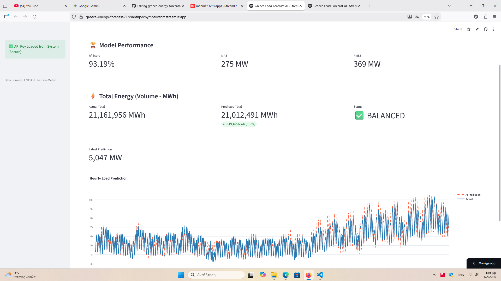

# greece-energy-forecast
# 🇬🇷 Greece Energy Market AI Desk ⚡


## 🚀 Live Demo
**Click below to access the live trading dashboard:**
### 👉 [Launch Energy Forecast App]((https://greece-energy-forecast-8ux9anfnpevhymbskvsnrr.streamlit.app/))

---

## 📸 Dashboard Preview
*Real-time forecasting with dynamic metric calculation (MAE, RMSE, Volume Analysis).*


*(The dashboard allows users to benchmark AI predictions against actual ENTSO-E data)*

---

## 🧠 Model Logic: Why "Lag-Free"?
This project demonstrates a **Fundamental Forecasting Approach**. Unlike standard autoregressive models that rely on past load data (e.g., $Load_{t-1}$), this model is **purely causal**.

It predicts electricity consumption based **ONLY** on:
1.  🌡️ **Temperature:** Real-time data from 5 key Greek cities (via Open-Meteo).
2.  📅 **Calendar Variables:** Hour, Day of Week, Seasonality, Holidays.

**Why this approach?**
* **Simulation Ready:** It allows for "What-if" scenarios (e.g., "What if the temperature drops 5°C?") without needing previous load data.
* **No Error Propagation:** In multi-step forecasting (e.g., predicting 24 hours ahead), lag-based models accumulate errors. This fundamental model remains stable regardless of the forecast horizon.
* **Robustness:** It proves that the model learns the *physical relationship* between weather and energy, rather than just memorizing recent trends.

---

## 🎯 Project Overview
This tool simulates a **Day-Ahead Energy Trading Desk** for the Greek Power Market. It solves real-world engineering challenges:
1.  **Volume Analysis (MWh):** Calculates total energy volume to assess trading positions (Long/Short).
2.  **Resolution Handling:** Automatically standardizes mixed data resolutions (e.g., 15-min vs. 60-min data) from ENTSO-E using robust resampling techniques.

## 📊 Key Features
* **🔌 Live ENTSO-E Integration:** Fetches real-time actual load data via API.
* **☀️ Open-Meteo Weather Data:** Parallel fetching of temperature data without API keys.
* **📉 Dynamic Backtesting:** Users can select any historical date range to validate model performance instantly.
* **🛡️ Secure Architecture:** Uses `secrets.toml` for API key management, preventing credential leaks.

## 🛠️ Tech Stack
* **Core:** Python, Pandas, NumPy
* **ML Engine:** LightGBM (Gradient Boosting Framework)
* **Visualization:** Plotly Interactive Charts
* **API Handling:** `requests`, `xml.etree` (XML Parsing)
* **Deployment:** Streamlit Cloud

## 📂 Repository Structure
```text
├── app.py               # Main Dashboard Application
├── lightgbm_model_Temp.pkl   # Trained Machine Learning Model
├── requirements.txt     # Python Dependencies
└── .streamlit/          # Secrets configuration (Local)
